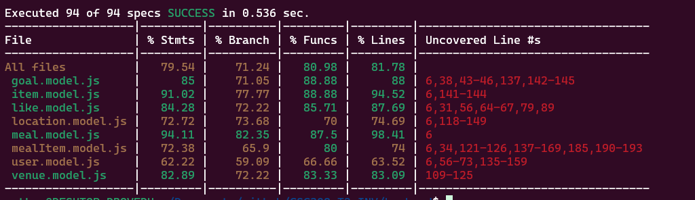

# Poly Meals LLC

Glenn Anciado, Felix Tran, Oscar Chau, Louis Rocha, Nathan Martinez

https://polymeals-6cae1.firebaseapp.com/

https://docs.google.com/presentation/d/1spXJGxOnz2LIWE1FMU0uk2lXo4zdT0xrrh6I69X_d24/edit?usp=sharing

## Code Coverage (Backend)

We used the package `nyc` for checking coverage. If you'd like to run it, make sure to host a local database and run ```npm run cov``` while being within the backend directory. For context, we didn't write test cases for some rest APIs, and I got rid of the user creation test cases because user was changed a couple of times, and I would spend a long time re-adjusting the test cases.



## Setting Up Your `.env` File

This project uses a `.env` file to manage environment variables for local development. To get started, follow these steps:
If you don't have an `.env` file already, create one in the root directory of the backend:

```bash
touch .env
```

```Example .env
# Example Server Port
PORT=3000

# Example PostgreSQL Configuration
POSTGRES_DB=postgres
POSTGRES_USER=nate
POSTGRES_PASSWORD=mysecretpassword
```

## Unit Tests with Jasmine & SuperTest

We're using Jasmine and SuperTest for unit testing. So, not conventional for the class but its a preference :D

### Prettier

This project uses [Prettier](https://prettier.io/) to automatically format code and ensure consistent style across the codebase. The default Prettier settings are applied in the .prettierrc.json.

## ESLint

This project uses [ESLint](https://ESLint.org) for linting. Settings are within eslint.config.mjs.


# Project Setup
## Prerequisites

Make sure you have the following installed on your machine:
- Node.js
- npm (Node Package Manager)
- Python (for the scraper)

## Getting Started

## Backend

1. Navigate to the backend directory:
    ```sh
    cd backend
    ```

2. Install the dependencies:
    ```sh
    npm install
    ```

3. Start the backend server:
    ```sh
    npm run start
    ```

## Frontend

1. Navigate to the frontend directory:
    ```sh
    This should be root directory
    ```

2. Install the dependencies:
    ```sh
    npm install
    ```

3. Start the frontend server:
    ```sh
    npm start
    ```

## Additional Scripts

### Scraper

Before running the scraper, make sure the backend is online and the database is restarted.
Also, run ```npm run pop``` to populate the database with venues.
- **Run scrape.py**
  ```sh
    cd scraper
    pip install -r requirements.txt
    python3 scrape.py
    ```


## Backend

- **Build the project**:
    ```sh
    npm run build
    ```

- **Run tests and refresh database**:
    ```sh
    npm run hardTest
    ```

- **Lint the code**:
    ```sh
    npm run lint
    ```

- **Reset Database**:
    ```sh
    npm run resetDB
    ```

## Frontend

- **Build the project for production**:
    ```sh
    npm run build
    ```

- **Run tests**:
  
    ```sh
    npm test
    ```

## Frontend web Deploy

  ```sh
      npm install -g firebase-tools
      firebase login
      firebase init
      npm run build
      firebase deploy
  ```
